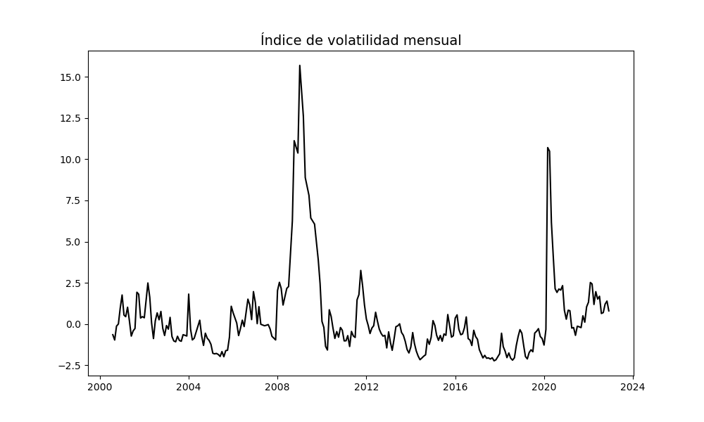
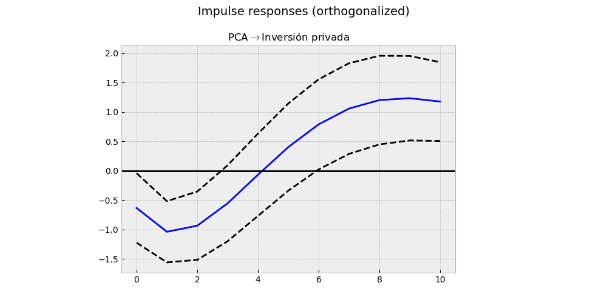
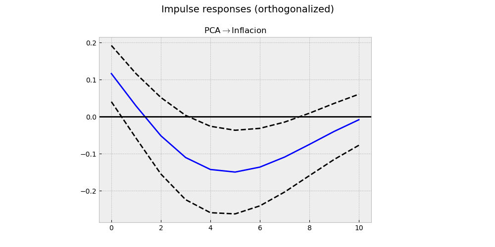
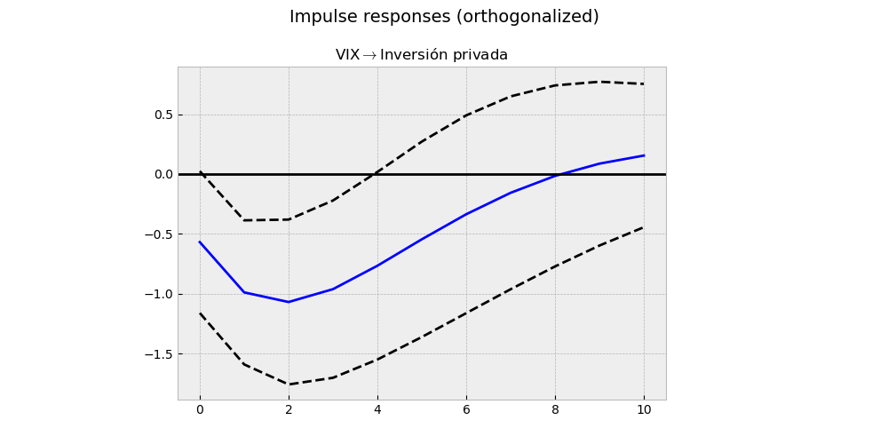
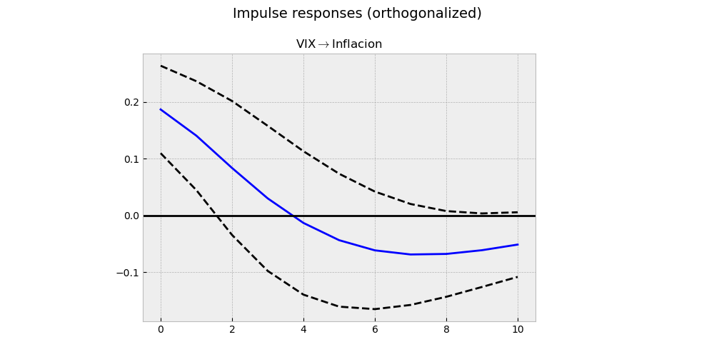

# Índice de incertidumbre vía PCA
Creación de una índice de incertidumbre vía la volatilidad de series financieras. La volatilidad condicional de cada serie es contruída mediante un modelo GARCH(1,1), donde los errores están distribuídos mediante una t-student. Luego, cada volatilidad permite construir un índice único mediante Componentes Principales (PCA).

  

Se estimó un modelo VAR para estudiar la interacción del índice frente a la `inversión privada` e `inflación` Se encontró que la incertidumbre reduce significativamente a la inversión privada por tres trimestres. En el caso de la inflación, la aumenta por un periodo, y luego se reduce a partir del tercer trimestre hasta el sétimo. Luego, también se estimó el modelo en el que se cambió la variable de incertidumbre por el índice VIX, como ejercicio de robustez. Se encuentran resultados consistentes.

## IRFs del índice creado por PCA

  

  

## IRFs del VIX

  

  

